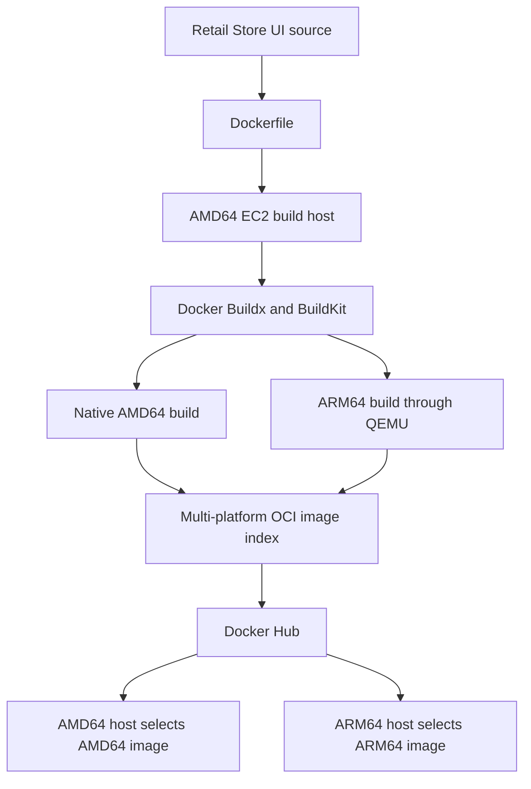

# Multi-Architecture Docker Image with Docker Buildx

This module demonstrates how I built and published the **AWS Retail Store UI** as a single multi-platform Docker image supporting both AMD64 and ARM64 processors.

The build was performed on an AMD64 Amazon Linux EC2 instance using Docker Buildx, BuildKit and QEMU. The final OCI image index was published to Docker Hub.
## Architecture


## Project result

**Docker Hub image:** [`sajanvethakumar/retail-ui-multiarch:1.0.0`](https://hub.docker.com/r/sajanvethakumar/retail-ui-multiarch)

Supported platforms:

- `linux/amd64` — Intel/AMD computers and EC2 instances
- `linux/arm64` — AWS Graviton and other ARM-based systems

One image tag contains an image variant for each architecture. When the image is pulled, Docker automatically selects the variant that matches the host.

```text
sajanvethakumar/retail-ui-multiarch:1.0.0
├── linux/amd64
└── linux/arm64
```

## Architecture



## Technologies used

- Amazon EC2
- Amazon Linux 2023
- Docker Engine
- Docker Buildx
- BuildKit
- QEMU and `binfmt_misc`
- Docker Hub
- Java 21 Amazon Corretto
- Maven
- AWS Retail Store Sample Application

## Why Docker Buildx?

A regular Docker build normally creates an image for the architecture of the build machine. Because my EC2 build host uses `x86_64`, a normal build would generally produce only a `linux/amd64` image.

Docker Buildx allows one build command to produce multiple platform-specific variants:

```text
Without Buildx: AMD64 host → AMD64 image only

With Buildx:    AMD64 host → AMD64 image
                          └→ ARM64 image through QEMU
```

This allows the same image name and tag to run on both x86 EC2 instances and ARM-based AWS Graviton instances.

## Implementation

### 1. Verify the build host

```bash
cat /etc/os-release | sed -n '1,6p'
uname -m
docker --version
docker buildx version
df -h /
```

Expected build-host architecture:

```text
x86_64
```

### 2. Enable ARM64 emulation

The AMD64 build host needs QEMU to execute ARM64 build steps:

```bash
docker run --privileged --rm \
  tonistiigi/binfmt --install arm64
```

QEMU is used only for the non-native ARM64 build. Native AMD64 steps run directly on the EC2 host architecture.

### 3. Create the Buildx builder

```bash
docker buildx create \
  --name multiarch \
  --driver docker-container \
  --use
```

Bootstrap and inspect the builder:

```bash
docker buildx inspect --bootstrap
docker buildx ls
```

The `docker-container` driver runs BuildKit in a dedicated container and supports multi-platform output.

### 4. Configure the image name

```bash
export DOCKERHUB_USER="sajanvethakumar"
export DH_REPO="retail-ui-multiarch"
export TAG="1.0.0"
export IMAGE="${DOCKERHUB_USER}/${DH_REPO}:${TAG}"

echo "${IMAGE}"
```

Expected value:

```text
sajanvethakumar/retail-ui-multiarch:1.0.0
```

### 5. Authenticate to Docker Hub

```bash
docker login --username "${DOCKERHUB_USER}"
```

A Docker Hub personal access token should be used instead of storing a password in scripts or Git.

### 6. Obtain the application source

This implementation uses version `1.3.0` of the AWS Retail Store Sample Application:

```bash
mkdir -p ~/demo-multiarch
cd ~/demo-multiarch

wget \
  https://github.com/aws-containers/retail-store-sample-app/archive/refs/tags/v1.3.0.zip

unzip v1.3.0.zip
cd retail-store-sample-app-1.3.0/src/ui
```

Confirm that the Dockerfile exists:

```bash
test -f Dockerfile && echo "Dockerfile found"
```

### 7. Build and publish both architectures

```bash
docker buildx build \
  --builder multiarch \
  --platform linux/amd64,linux/arm64 \
  --tag "${IMAGE}" \
  --push .
```

This command:

1. Reads the UI Dockerfile.
2. Builds an AMD64 image natively.
3. Builds an ARM64 image using QEMU emulation.
4. Creates a multi-platform OCI image index.
5. Pushes the variants and image index to Docker Hub.

The ARM64 build can take considerably longer because it is emulated on an AMD64 host.

## Verification

Inspect the published image without pulling all of its layers:

```bash
docker buildx imagetools inspect \
  sajanvethakumar/retail-ui-multiarch:1.0.0
```

The important entries are:

```text
Platform: linux/amd64
Platform: linux/arm64
```

Entries reported as `unknown/unknown` can be BuildKit attestation manifests. They do not necessarily indicate an unsuccessful architecture build.

## AMD64 runtime test

Run the AMD64 variant on an x86 EC2 instance:

```bash
docker run \
  --name retail-ui-amd64 \
  --platform linux/amd64 \
  --publish 8888:8080 \
  --detach \
  sajanvethakumar/retail-ui-multiarch:1.0.0
```

Check the container:

```bash
docker ps
docker logs retail-ui-amd64
curl --fail http://localhost:8888/actuator/health
```

Traffic flow:

```text
Browser → EC2 port 8888 → Container port 8080 → Retail Store UI
```

Remove the test container:

```bash
docker rm --force retail-ui-amd64
```

## ARM64 runtime test

For native validation, start an ARM64 Amazon Linux EC2 instance such as a Graviton-based `t4g` instance.

Confirm its architecture:

```bash
uname -m
```

Expected:

```text
aarch64
```

Run the same image tag:

```bash
docker run \
  --name retail-ui-arm64 \
  --publish 8889:8080 \
  --detach \
  sajanvethakumar/retail-ui-multiarch:1.0.0
```

Docker should automatically select the `linux/arm64` image variant.

Verify:

```bash
docker ps
docker logs retail-ui-arm64
curl --fail http://localhost:8889/actuator/health
```

> ARM64 native runtime testing should be marked completed only after it has actually been performed on an ARM64 host.

## Troubleshooting performed

### Docker Hub push access denied

The initial push used an incorrect image path containing the Docker Hub username twice:

```text
sajanvethakumar/sajanvethakumar/retail-ui-multiarch:1.0.0
```

This resulted in an error similar to:

```text
push access denied, repository does not exist or may require authorization
```

The repository variable was corrected so that it contained only the repository name:

```bash
export DOCKERHUB_USER="sajanvethakumar"
export DH_REPO="retail-ui-multiarch"
export IMAGE="${DOCKERHUB_USER}/${DH_REPO}:${TAG}"
```

Correct result:

```text
sajanvethakumar/retail-ui-multiarch:1.0.0
```

After confirming the repository and Docker Hub authentication, the cached build was pushed using the corrected image name.

### Check build disk usage

Multi-platform builds can consume substantial storage through base images, architecture-specific layers and BuildKit cache.

```bash
df -h /
docker system df
docker buildx du
```

## Security considerations

- Docker Hub credentials are not stored in the repository.
- A personal access token is used for registry authentication.
- The Dockerfile runs the application as a non-root user.
- No `.env`, private key, Docker configuration or AWS credential file is committed.
- The ARM64 emulator is installed deliberately because `docker run --privileged` modifies host-level binary-format handlers.
- Exact version tags are preferred over relying only on `latest`.

## Safe cleanup

Remove test containers:

```bash
docker rm --force retail-ui-amd64 2>/dev/null || true
docker rm --force retail-ui-arm64 2>/dev/null || true
```

Inspect builder storage:

```bash
docker buildx du
docker system df
```

Remove the lab builder only when it is no longer required:

```bash
docker buildx use default
docker buildx rm multiarch
```

Log out of Docker Hub:

```bash
docker logout
```

Avoid broad cleanup commands that could remove resources belonging to unrelated Docker projects.

## Completed work

- [x] Verified the AMD64 Amazon Linux build host
- [x] Enabled ARM64 emulation using QEMU/binfmt
- [x] Created a containerized Buildx builder
- [x] Built the Retail Store UI for `linux/amd64` and `linux/arm64`
- [x] Created one multi-platform OCI image tag
- [x] Published the image to my Docker Hub repository
- [x] Corrected and documented the Docker Hub repository-path issue

## Validation checklist

Complete these checks and retain their output as project evidence:

- [ ] Confirm both platforms using `docker buildx imagetools inspect`
- [ ] Run the health check on the AMD64 EC2 instance
- [ ] Test the same tag natively on an ARM64/Graviton instance
- [ ] Record the build duration and final image digests

## Planned enhancements

- [ ] Add semantic-version and Git SHA tags
- [ ] Add registry-backed BuildKit caching
- [ ] Measure cold and cached build durations
- [ ] Add automated manifest verification
- [ ] Add architecture-specific smoke tests
- [ ] Generate SBOM and provenance attestations
- [ ] Add container vulnerability scanning
- [ ] Automate builds with GitHub Actions
- [ ] Publish an additional image to Amazon ECR

These items remain marked as planned until they have been implemented and validated.

## Repository contents

```text
docker/buildx/
├── README.md
├── Dockerfile
├── .dockerignore
├── scripts/
│   └── verify-manifest.sh
└── docs/
    ├── buildx-architecture.png
    └── manifest-output.txt
```

The Docker image itself is stored in Docker Hub. GitHub stores the source configuration, documentation, scripts and verification evidence.

## Learning outcome

This module demonstrates that one Docker tag can represent multiple architecture-specific images. Docker selects the appropriate image automatically based on the target host, allowing the same release to run across traditional x86 infrastructure and AWS Graviton environments.

## Credits and attribution

This implementation is based on:

- [Stacksimplify – DevOps Real-World Project Implementation on AWS](https://github.com/stacksimplify/devops-real-world-project-implementation-on-aws/tree/main/05_Docker_Buildx)
- [AWS Containers – Retail Store Sample Application](https://github.com/aws-containers/retail-store-sample-app)
- [Docker documentation – Multi-platform builds](https://docs.docker.com/build/building/multi-platform/)

The sample application and its original Dockerfile belong to their respective authors and are used according to the upstream project licensing and attribution requirements. My work in this module focuses on the Buildx implementation, multi-platform publishing, verification and troubleshooting.

